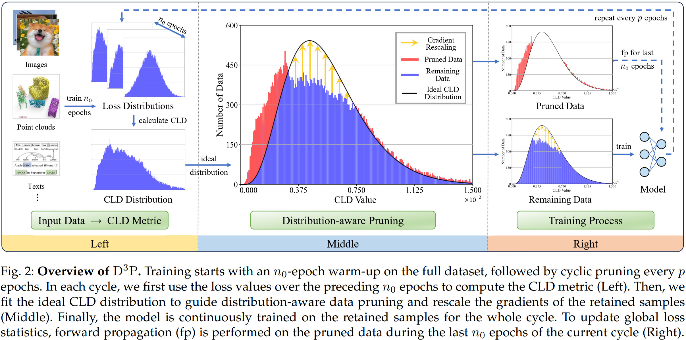
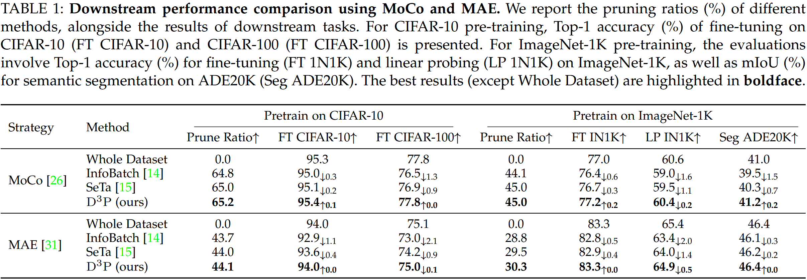

# Distribution-aware Dynamic Data Pruning for Representation Learning

This is the PyTorch implementation of our paper ‘Distribution-aware Dynamic Data Pruning for Representation Learning’. In this repository, we insert $\mathrm{D}^3\mathrm{P}$ into the pre-training pipeline of Masked Autoencoders (MAE).

---

## Overview



---

## Introduction

$\mathrm{D}^3\mathrm{P}$ is a novel distribution-aware dynamic data pruning framework plug-and-play with various data modalities, model architectures, and learning paradigms. $\mathrm{D}^3\mathrm{P}$ adaptively determines an optimal pruning ratio to ensure lossless performance.

- We design a CLD metric to distinguish true redundancy from training volatility. Unlike instantaneous loss baselines, CLD uses second-order statistics to preserve high-variance yet informative data, ensuring robustness in unstable self-supervised and multimodal regimes.

- We formulate a data pruning strategy that excludes redundant samples outside the ideal chi-square distribution of CLD. This approach adaptively determines the optimal pruning boundary without requiring fixed-ratio heuristics and labor-intensive tuning.
- Extensive experiments across 22 datasets (covering 1D, 2D, 3D, and multimodal data), 8 learning strategies, and 9 tasks, demonstrate the effectiveness of $\mathrm{D}^3\mathrm{P}$. Our method significantly reduces the training costs, while maintaining lossless performance.

---

## Installation

Please follow the environment setup of the original [MAE](https://github.com/facebookresearch/mae) repository.

Additionally, install the following dependencies:

```bash
Python 3.70
PyTorch == 1.8.0
TorchVision == 0.9.0
Numpy == 1.23.5
Scipy == 1.10.1
timm == 0.3.2
TensorBoard
tqdm
```

---

## Train

### 1. Prepare training data

1.1 Download the [ImageNet-1K](https://www.image-net.org/) dataset, ensuring that the extracted directory contains the standard `train/` and `val/` subdirectories. Then the structure is as follows:

```
ImageNet/
├── train/
│   ├── n01440764/
│   │   ├── *.JPEG
│   │   └── ...
│   ├── n01443537/
│   └── ...
└── val/
    ├── n01440764/
    ├── n01443537/
    └── ...
```

1.2 In `train_d3p.sh`, replace `/path/to/data` with the absolute path to your local ImageNet-1K dataset.

### 2. Training

Run MAE pre-training with $\mathrm{D}^3\mathrm{P}$, followed by the downstream finetuning task:

```bash
./train_d3p.sh
```

---

## Comparative Results



------

## Acknowledgement

This repository is built upon [MAE](https://github.com/facebookresearch/mae). Thanks for their efforts to the community.

